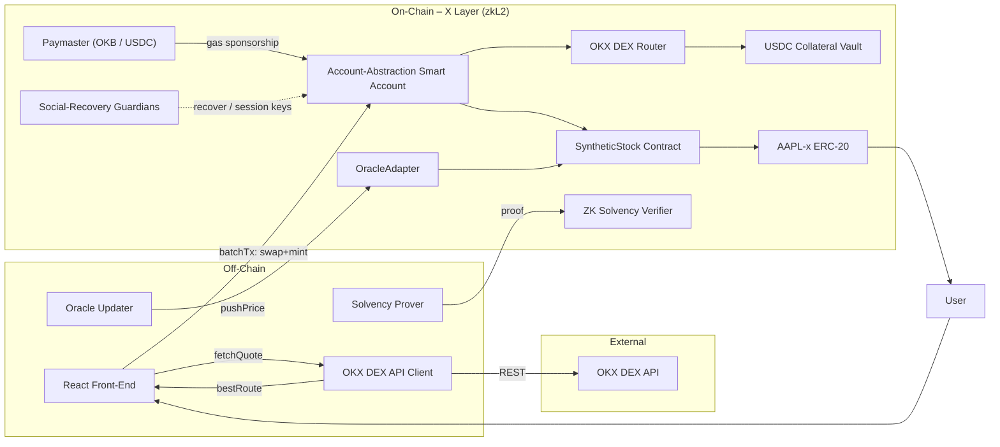

# Software Design Document – Synthetic-Stock dApp

> Last updated: 2025-07-13

---

## 1  Purpose & Scope

Build a crypto-native application on **OKX X Layer** that allows users to mint and redeem **AAPL-x** (a synthetic Apple share) using USDC as collateral while natively integrating the **OKX DEX API** for token swaps and route simulation.

* Track alignment: fulfills all four hackathon tracks (see §12)
* MVP: single stock, 150 % over-collateralisation, oracle price updates every 5 min.

---

## 2  Stakeholders

| Role | Responsibility |
|------|----------------|
| End User | Swap any token ➜ USDC ➜ AAPL-x, redeem back, recover wallet |
| Oracle Operator | Pushes AAPL price to on-chain oracle |
| DEX Liquidity Providers | Supply liquidity accessed via OKX DEX API |
| Hackathon Judges | Evaluate UX, infra, security, track coverage |

---

## 3  High-Level Architecture

---

## 4  Functional Requirements

* **FR-1 Mint** – deposit USDC ➜ receive AAPL-x.
* **FR-2 Redeem** – burn AAPL-x ➜ receive USDC.
* **FR-3 Price Update** – on-chain oracle every ≤5 min.
* **FR-4 Gasless UX** – Paymaster covers gas; accepts USDC.
* **FR-5 Social Recovery** – 2-of-3 guardian scheme.
* **FR-6 Swap-and-Mint** – any X Layer token ➜ USDC via OKX DEX API, followed by mint in one batched tx.
* **FR-7 Redeem-and-Swap** – optional swap of USDC to ETH/OKB via DEX API.
* **FR-8 Route Simulation** – slippage & gas estimation using DEX API simulation endpoint.
* **FR-9 Bridge Helper** – CLI deep-links OKX Bridge for USDC to X Layer.

---

## 5  Non-Functional Requirements

* <100 ms average DEX API latency [[link1]](https://web3.okx.com/build/dev-docs/dex-api/dex-what-is-dex-api)
* X Layer tx cost ≈ 0.0055 USD, 400 ms block time [[link2]](https://web3.okx.com/xlayer)
* Upgradable via UUPS proxies; pausable emergency stop.
* Security: re-entrancy guards, oracle sanity checks, zk-proof of solvency.

---

## 6  Detailed Component Design (excerpt)

### 6.1 SyntheticStock Contract
* Storage: `collateralRatio`, `oracle`, `usdc`, `aaplx`, etc.
* `mint(uint256 usdcIn)` / `redeem(uint256 aaplxIn)`
* Emits `Minted`, `Redeemed` events.

### 6.2 OracleAdapter
* `pushPrice(int256 price) onlyOperator`
* Stores `latestPrice`, `lastUpdated`.

### 6.3 OKXDEXService (TS)
* `getQuote()`, `simulateTx()`, `buildTx()`
* Caches for 30 s, retries exponential back-off.

### 6.4 AA & Paymaster
* Implements EIP-4337; Paymaster validates swap+mint calldata.

### 6.5 ZK Solvency Module
* Circom circuit proves `totalCollateral ≥ 1.5 × totalSupply` once per week.

---

## 7  Data Models

| Entity | Format | Notes |
|--------|--------|-------|
| AAPL-x | ERC-20, 18 decimals | Synthetic share |
| USDC | ERC-20, 6 decimals | Collateral |
| Oracle Price | `int256` scaled 1e8 | e.g. 150.34 → 15034000000 |

---

## 8  Sequence Flows (MVP)

**Swap-and-Mint**
1. User selects token & amount.
2. Front-end ➜ DEX API `/quote`.
3. Show best route.
4. AA `execBatch([swap, mint])`.
5. Router swaps to USDC ➜ Vault.
6. SynthContract mints AAPL-x ➜ user.

**Redeem-and-Swap** mirrors the above.

---

## 9  Security Considerations

* Slippage limit & route checksum before signing.
* Pause minting if collateral ratio < 150 %.
* zk-proof verifier ensures solvency.

---

## 10  Tech Stack

* Solidity 0.8.x, Hardhat, OpenZeppelin.
* React 18 / Next.js 13, wagmi, ethers.js.
* OKX DEX API (REST), Axios.
* X Layer testnet RPC.

---

## 11  Timeline (3 July – 3 August)

| Date Range | Objectives |
|------------|------------|
| 13 Jul – 17 Jul (Week 1) | Project kickoff: repo scaffolding, Hardhat & Next.js setup, initial contract stubs, CI pipeline |
| 18 Jul – 22 Jul (Week 2) | Implement & unit-test core contracts (`SyntheticStock`, `OracleAdapter`, `CollateralVault`); deploy to local & X Layer testnet with mock USDC |
| 23 Jul – 27 Jul (Week 3) | Integrate **OKX DEX API** client; build swap-and-mint flow; implement basic React UI (connect wallet, mint, redeem) |
| 28 Jul – 1 Aug (Week 4) | Add **Account Abstraction** wallet & Paymaster, social recovery, batch `swap+mint` and `redeem+swap`; UI polish & responsive design |
| 2 Aug – 3 Aug (Final) | Oracle updater cron, zk-solvency proof POC, full QA on X Layer, security review, demo video, submission package |

---

## 12  Track Mapping

| Track | Features |
|-------|----------|
| Smart Account UX | AA wallet, social recovery, session keys, gasless UX |
| Next-Gen Infra | X Layer ZK rollup, blob-streamed oracle, stateless proof roadmap |
| Security & Privacy | zk-proof of solvency, MEV-resistant batching, guardian recovery |
| DeFi / RWAs | Synthetic AAPL-x, collateral vault, autonomous rebalancer |

---

© 2025 Synthetic Stock Warriors – Hackathon submission 